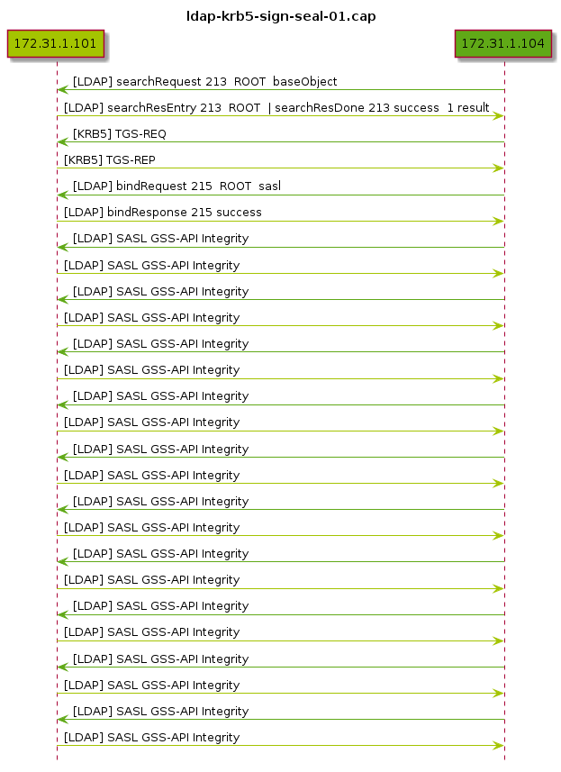

# ``pcap2uml``

Create UML Sequence Diagram from PCAP file.

## Dependencies

-  http://plantuml.com/sequence-diagram

## Example

```bash

# ./pcap2uml ldap-krb5-sign-seal-01.cap | tee ldap-krb5-sign-seal-01.uml

```

```uml
@startuml


title ldap-krb5-sign-seal-01.cap

hide footbox
participant "172.31.1.101" #a4c400
participant "172.31.1.104" #60a917

172.31.1.104 -[#60a917]> 172.31.1.101 : [LDAP] searchRequest 213  ROOT  baseObject
172.31.1.101 -[#a4c400]> 172.31.1.104 : [LDAP] searchResEntry 213  ROOT  | searchResDone 213 success  1 result
172.31.1.104 -[#60a917]> 172.31.1.101 : [KRB5] TGS-REQ
172.31.1.101 -[#a4c400]> 172.31.1.104 : [KRB5] TGS-REP
172.31.1.104 -[#60a917]> 172.31.1.101 : [LDAP] bindRequest 215  ROOT  sasl
172.31.1.101 -[#a4c400]> 172.31.1.104 : [LDAP] bindResponse 215 success
172.31.1.104 -[#60a917]> 172.31.1.101 : [LDAP] SASL GSS-API Integrity
172.31.1.101 -[#a4c400]> 172.31.1.104 : [LDAP] SASL GSS-API Integrity
172.31.1.104 -[#60a917]> 172.31.1.101 : [LDAP] SASL GSS-API Integrity
172.31.1.101 -[#a4c400]> 172.31.1.104 : [LDAP] SASL GSS-API Integrity
172.31.1.104 -[#60a917]> 172.31.1.101 : [LDAP] SASL GSS-API Integrity
172.31.1.101 -[#a4c400]> 172.31.1.104 : [LDAP] SASL GSS-API Integrity
172.31.1.104 -[#60a917]> 172.31.1.101 : [LDAP] SASL GSS-API Integrity
172.31.1.101 -[#a4c400]> 172.31.1.104 : [LDAP] SASL GSS-API Integrity
172.31.1.104 -[#60a917]> 172.31.1.101 : [LDAP] SASL GSS-API Integrity
172.31.1.101 -[#a4c400]> 172.31.1.104 : [LDAP] SASL GSS-API Integrity
172.31.1.104 -[#60a917]> 172.31.1.101 : [LDAP] SASL GSS-API Integrity
172.31.1.101 -[#a4c400]> 172.31.1.104 : [LDAP] SASL GSS-API Integrity
172.31.1.104 -[#60a917]> 172.31.1.101 : [LDAP] SASL GSS-API Integrity
172.31.1.101 -[#a4c400]> 172.31.1.104 : [LDAP] SASL GSS-API Integrity
172.31.1.104 -[#60a917]> 172.31.1.101 : [LDAP] SASL GSS-API Integrity
172.31.1.101 -[#a4c400]> 172.31.1.104 : [LDAP] SASL GSS-API Integrity
172.31.1.104 -[#60a917]> 172.31.1.101 : [LDAP] SASL GSS-API Integrity
172.31.1.101 -[#a4c400]> 172.31.1.104 : [LDAP] SASL GSS-API Integrity
172.31.1.104 -[#60a917]> 172.31.1.101 : [LDAP] SASL GSS-API Integrity
172.31.1.101 -[#a4c400]> 172.31.1.104 : [LDAP] SASL GSS-API Integrity

@enduml

```bash

# java -jar ~/bin/plantuml.jar ldap-krb5-sign-seal-01.uml

```




## License

-  all software licensed under the terms of the GNU General Public License:
   [](https://www.gnu.org/licenses/gpl-3.0)

-  all documentation, notes, ideas, graphics and sounds are licensed under the Creative Commons Attribution-ShareAlike 4.0 International License:
   [](https://creativecommons.org/licenses/by-sa/4.0/)

## Author Information

[Osiris Alejandro Gómez](https://www.osiux.com/), worker cooperative of [gcoop Cooperativa de Software Libre](https://www.gcoop.coop/).

